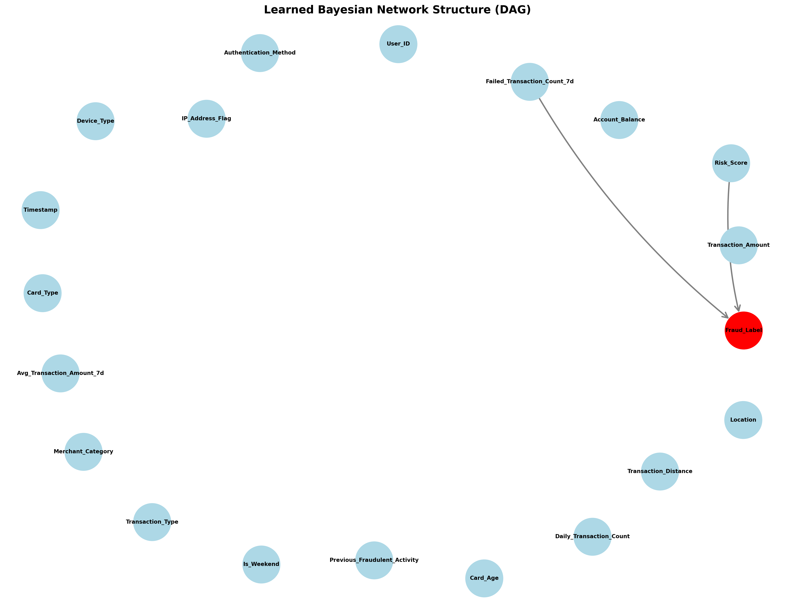
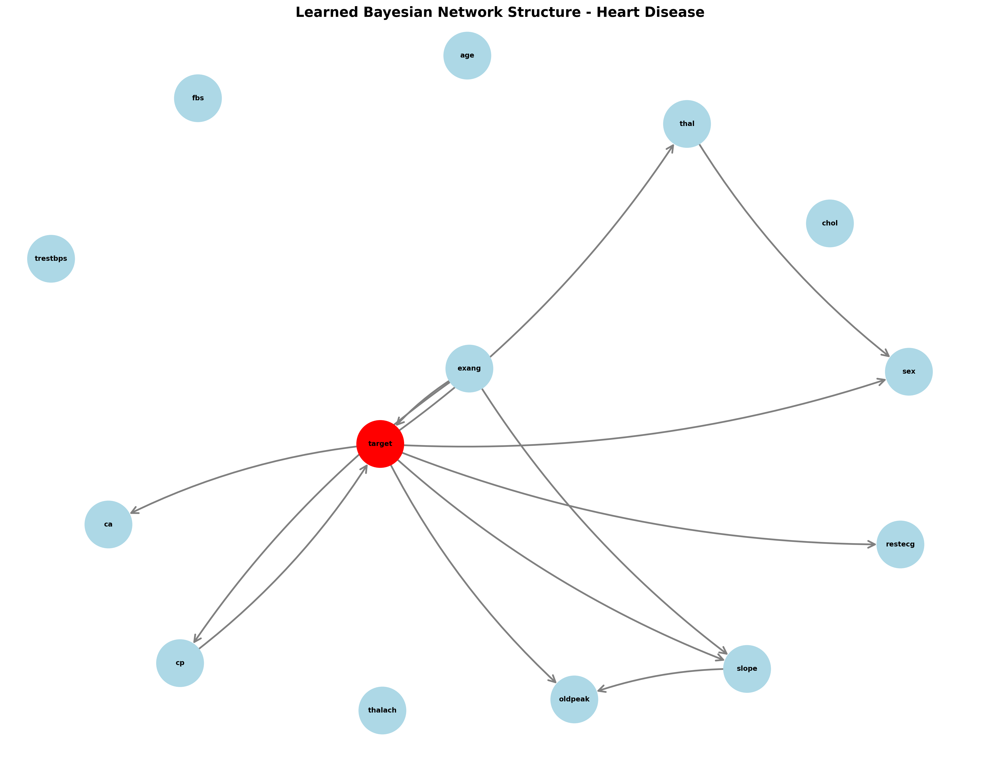
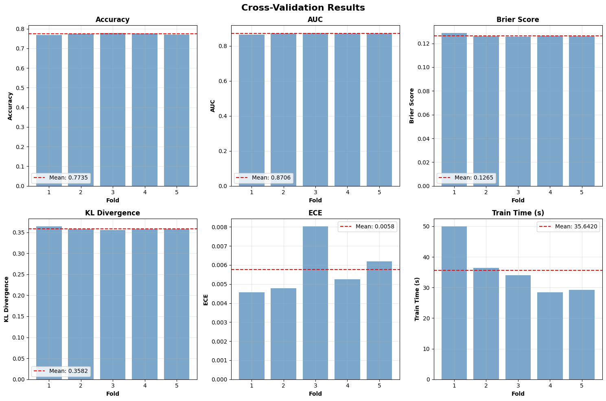
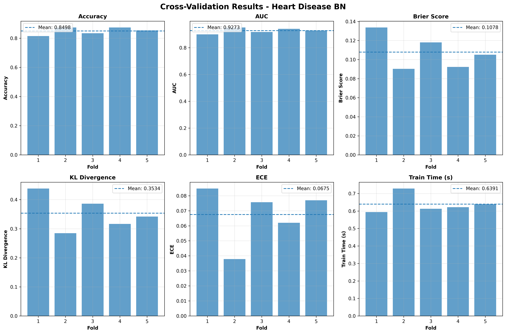

# Probabilistic AI for Fraud Detection & Heart Disease Diagnosis  
**Discrete Bayesian Networks (bnlearn + pgmpy) and Variational Sparse Gaussian Processes (GPyTorch)**

This repository implements **two probabilistic modelling pipelines** on two datasets:

1. **Discrete Bayesian Networks (DBN-style discrete BN)**  
   - **Structure learning:** `bnlearn` (Hill-Climb + BIC)  
   - **Parameter learning & inference:** `pgmpy` (MLE / Variable Elimination)  
   - **Evaluation:** 5-fold CV with Accuracy, AUC, Brier, KL Divergence, ECE (+ confusion matrix where applicable)

2. **Variational Sparse Gaussian Process (VSGP) for probabilistic classification**  
   - **Inference:** MacKay’s approximation (learnable a, b, c) or likelihood-ratio alternative  
   - **Evaluation:** 5-fold stratified CV with Accuracy, ROC-AUC, PR-AUC, Brier, ECE, KL, Cross-Entropy  
   - **Outputs:** calibration curves + fold metric plots, plus model saving/loading for deployment

---

## Key Figures (Report Outputs)

### Learned Bayesian Structure (Fraud)

### Learned Bayesian Structure (Heart Disease)

### DBNs 5-fold CV Results (Fraud)

### GP 5-fold CV Results (Heart Disease)

---

## Repository Structure

    ├── .devcontainer/
    │   ├── devcontainer.json
    │   └── Dockerfile
    ├── bayesianNetwork_bn_pgmpy/
    │   ├── BN_fraud_bn+pgmpy.ipynb
    │   ├── BN_heart_bn+pgmpy.ipynb
    │   └── results/
    ├── gaussian_process_mackay/
    │   ├── Mackay_fraud.ipynb
    │   └── Mackay_heart.ipynb
    ├── dataset/
    │   ├── synthetic_fraud_dataset.csv
    │   └── heart.csv
    └── quirieS_gp/
        ├── models/
        ├── q_bn_fraud.ipynb
        ├── q_bn_heart.ipynb
        ├── q_gp_fraud.ipynb
        └── q_gp_heart.ipynb

---

## Environment Setup (Recommended: Dev Container)

This repo includes a ready-to-use **VS Code Dev Container**.

### 1) Prerequisites
- Docker Desktop
- VS Code + “Dev Containers” extension

### 2) Launch
1. Open the repo in VS Code
2. `Ctrl+Shift+P` → **Dev Containers: Reopen in Container**
3. The container builds from `./.devcontainer/Dockerfile` and installs:
   - `bnlearn`, `pgmpy==0.1.25`
   - `torch`, `gpytorch`
   - `scikit-learn`, `numpy`, `scipy`, `matplotlib`, `seaborn`, `tqdm`

---

## Running the Experiments

### Datasets
Place datasets exactly here (already in repo):
- `dataset/synthetic_fraud_dataset.csv`
- `dataset/heart.csv`

### A) Bayesian Network (Fraud)
Notebook:
- `bayesianNetwork_bn_pgmpy/BN_fraud_bn+pgmpy.ipynb`

What it does:
- Discretizes continuous features (KBins discretizer)
- Learns BN structure with **Hill-Climb + BIC**
- Fits CPTs using **MLE**
- Performs inference with **Variable Elimination**
- Runs **5-fold CV** + saves figures/models

### B) Bayesian Network (Heart Disease)
Notebook:
- `bayesianNetwork_bn_pgmpy/BN_Heart_bn+pgmpy.ipynb`

What it does:
- Treats the heart dataset as discrete-coded (casts to int; no heavy binning)
- Learns structure (optionally constrained indegree)
- Fits CPTs (MLE or fallback Bayesian estimator if needed)
- Runs **5-fold CV** + saves figures/models

### C) Variational Sparse GP (Fraud)
Notebook:
- `gaussian_process_mackay/Mackay_fraud.ipynb`  
or script-style notebook:
- `quiries_gp/q_gp_fraud.ipynb`

What it does:
- One-hot encodes categorical features
- Standardizes inputs
- Uses **KMeans inducing points**
- Trains VSGP via **Variational ELBO**
- Converts predictions to probabilities via **MacKay approximation**
- Runs **5-fold stratified CV**
- Saves best model to `fraud_detector_vsgp.pkl`

### D) Variational Sparse GP (Heart Disease)
Notebook:
- `gaussian_process_mackay/Mackay_heart.ipynb`  
or:
- `quiries_gp/q_gp_heart.ipynb`

What it does:
- Standard preprocessing (numeric cast + median imputation)
- VSGP training + MacKay probability output
- **ROC + calibration curve** visualization
- Saves model to `heart_disease_model.pkl`

---

## Outputs

Depending on which notebook you run, you will produce:

### Bayesian Network
- DAG plots (structure)
- 5-fold CV summary plots
- (Fraud) confusion matrix + parent-child influence charts
- Saved models (`.pkl`) including BN edges + pgmpy model

### Gaussian Process
- Calibration curve plots
- Fold performance metric comparison
- Saved VSGP models (`.pkl`) with scaler + state dicts

---

## Notes on Inference Queries

Both pipelines include **example “queries”**:

### BN (pgmpy Variable Elimination)
- Query 1: marginal probability of target
- Query 2: conditional probability of target given evidence

### GP (MacKay Approximation)
- Predicts a probability using:
  \[
    \sigma\left(\frac{\mu a + b}{\sqrt{1 + \pi \sigma^2 c/8}}\right)
  \]
  where \(a,b,c\) are learned.

---

## Troubleshooting

- If a BN fold fails (rare with some structures), ensure:
  - all columns are integers after preprocessing
  - no unseen categories appear in test fold encoding
- If GP training is slow / memory-heavy:
  - reduce `NUM_INDUCING_POINTS` (e.g., 50–75 for fraud)
  - reduce `BATCH_SIZE`
  - lower `max_epochs` or increase early-stopping strictness

---

## Citation / Credits

This project uses:
- **bnlearn** for Bayesian Network structure learning  
- **pgmpy** for BN parameter learning and exact inference  
- **GPyTorch** for variational sparse GP modelling

